# InTown — Phase Implementation Plan (master index)

**Purpose.** This directory is the complete, self-contained build plan for InTown. Each `PNN-*.md` file is a *fine-grained phase* — a unit of work completable in a single Claude Code session even under usage-limit pressure. Phases are built on separate branches, possibly in **parallel sessions**, and merged later. Every phase file is written to be worked from **on its own**: a session needs only that one phase file plus the frozen `contracts/` seam — never the whole PRD.

## How to use this in a session

1. Open this INDEX. Pick a phase whose **dependencies are all merged to `main`** and that is **parallel-safe** with any phase currently in flight (see the protocol below).
2. Open that phase's file. Work **only** from it + `contracts/`. Do not open `FINAL_PRD.md` — everything you need is inlined. **P00 is the deliberate exception:** it transcribes §10, §11, §9.1 and §17.2–17.4 from the PRD into `contracts/`, which is exactly why every later phase can work from its phase file + the frozen `contracts/` seam and never needs the PRD.
3. On your **first commit**, flip this phase's status in the table below to 🟨 with your branch name (one-line edit, merges trivially).
4. Follow the phase's Resume checklist so an interrupted session can pick up by diffing `git log` on the branch against the checkboxes.

## Repo layout (after P00 merges)

```
/frontend      Vite + React + TS PWA → deployed to Vercel. Frontend phases write only here.
/backend       Fastify TS API + Python pipeline/solver workers + db/migrations (single canonical
               chain) + infra (docker-compose: Postgres+PostGIS, MinIO, Supabase Realtime, OSRM)
               → deployed to a dedicated VPS. Backend phases write only here.
/contracts     THE frozen seam (zod API+SSE schemas, shared TS types, generated python/ mirror,
               event catalog, unified category enum, design-tokens.json, golden fixtures).
               No build tooling. Read-only for every phase except P00 and dedicated contract mini-phases.
/phases        this plan.   /.claude   agent config.   docs at root (FINAL_PRD.md etc.).
```
Nothing else lives at root besides docs, `phases/`, `.claude/`, and workspace/CI config.

## Phase table

Status legend: ⬜ not started · 🟨 in progress (branch) · ✅ merged.

| ID | Title | Milestone | Depends on | Track | Size | Status |
|---|---|---|---|---|---|---|
| P00 | Foundations & contracts freeze | M1 | — | contracts + full-stack scaffold | L | ✅ |
| P01 | Design system & app shell | M1 | P00 | frontend | L | ✅ |
| P02 | Auth backend | M2 | P00 | backend | M | ✅ |
| P03 | Auth & consent UI | M2 | P01, P02 | frontend | M | ✅ |
| P04 | Profiles backend | M2 | P02 | backend | M | ✅ |
| P05 | Onboarding & profiles UI | M2 | P03, P04 | frontend | L | ⬜ |
| P06 | Trips & collaboration backend | M4 | P02 | backend | L | ⬜ |
| P07 | Trip creation & join UI | M4 | P01 | frontend | M | ⬜ |
| P08 | City Brain core | M3 | P00 | backend | L | ⬜ |
| P09 | Ingestion I — structured sources | M3 | P08 | backend | M | ⬜ |
| P10 | Ingestion II — web, media & safety | M3 | P09 | backend | L | ⬜ |
| P11 | AI pipeline & job queue | M3 | P08 | backend | L | ⬜ |
| P12 | City Brief & safety surfacing | M4 | P10, P01 | full-stack | M | ⬜ |
| P13 | Research pipeline UX | M4 | P01 | frontend | M | ⬜ |
| P14 | Curation & longlist backend | M4 | P06, P11 | backend | M | ⬜ |
| P15 | Curation UI & decision cards | M4 | P01 | frontend | L | ⬜ |
| P16 | Solver core | M3 | P00 | backend | L | ⬜ |
| P17 | Map platform backend | M4 | P08 | backend | M | ⬜ |
| P18 | Plan view UI | M4 | P01, P17 | frontend | L | ⬜ |
| P19 | Adaptation & replanning | M5 | P16, P18 | full-stack | L | ⬜ |
| P20 | Companion mode | M5 | P18 | frontend | M | ⬜ |
| P21 | Narration | M5 | P11 | full-stack | M | ⬜ |
| P22 | Offline bundles & PWA hardening | M5 | P18, P21 | frontend | L | ⬜ |
| P23 | Feedback & learning v1 | M6 | P06, P08 | backend | L | ⬜ |
| P24 | Notifications core | M6 | P06 | full-stack | M | ⬜ |
| P25 | Payments — Stripe pay-per-city | M6 | P06 | full-stack | M | ⬜ |
| P26 | Documents & ticket vault | M7 | P06, P22 | full-stack | M | ⬜ |
| P27 | Public reviews, moderation & DSA | M7 | P23 | full-stack | M | ⬜ |
| P28 | Multi-city trips | M7 | P16, P18 | full-stack | M | ⬜ |
| P29 | Gamification & community roles | M7 | P23 | full-stack | M | ⬜ |
| P30 | Social import & Want-to-go | M7 | P11 | full-stack | M | ⬜ |
| P31 | Growth pack | M7 | P23, P24 | full-stack | L | ⬜ |
| P32 | Native app (React Native/Expo) | M8 | P00–P25 (MVP) | full-stack | XL | ⬜ |
| P33 | Intelligence & community depth | M8 | P23, P31 | backend | L | ⬜ |

## Milestone legend (M1–M8 groupings + the demoable capability each unlocks)

Milestones group the phases that land together; each unlocks a concrete, demoable capability.

- **M1 — Foundation** (P00, P01): the frozen `contracts/` seam plus a booting dev stack. *Demo:* green CI, a healthy `docker compose` backend, and a deployable installable PWA shell.
- **M2 — Accounts & profiles** (P02–P05): auth, consent, and progressive taste profiling. *Demo:* a user signs in, gives consent, and completes onboarding into a saved traveler + taste profile.
- **M3 — Intelligence spine** (P08–P11, P16): City Brain, ingestion, AI pipeline, and solver running headless against real sources/fixtures. *Demo:* a cold city warms into cited atomic facts and the solver returns a feasible day plan from a request.
- **M4 — Collaboration & vertical slice** (P06, P07, P12–P15, P17, P18): the end-to-end golden-city slice. *Demo:* create trip → research → curate → solve → plan view + City Brief for one golden city.
- **M5 — Travel day** (P19–P22): companion mode, narration, adaptation/replanning, offline. *Demo:* walk a saved plan offline in companion mode with narration and a ≤5s "go-now" replan.
- **M6 — Feedback / notifications / launch** (P23–P25): post-visit feedback, notifications, and payments. *Demo:* finish a trip, leave feedback, receive a leave-by reminder, and pay per-city (first city free).
- **M7 — P2 depth** (P26–P31): vault, reviews + moderation, multi-city, gamification, social import, growth pack. *Demo:* import a want-to-go list, plan a multi-city trip, and store tickets in the vault.
- **M8 — P3 expansion** (P32, P33): native app plus intelligence/community depth. *Demo:* the React Native/Expo app runs the MVP flow, extended by embeddings/bandits and community guides.

## Dependency graph

```mermaid
graph TD
  P00[P00 Foundations]
  P00 --> P01[P01 Design system/shell]
  P00 --> P02[P02 Auth backend]
  P00 --> P08[P08 City Brain core]
  P00 --> P16[P16 Solver core]
  P01 --> P03[P03 Auth/consent UI]
  P02 --> P03
  P02 --> P04[P04 Profiles backend]
  P03 --> P05[P05 Onboarding/profiles UI]
  P04 --> P05
  P02 --> P06[P06 Trips/collab backend]
  P01 --> P07[P07 Trip create/join UI]
  P08 --> P09[P09 Ingestion I]
  P09 --> P10[P10 Ingestion II]
  P08 --> P11[P11 AI pipeline]
  P10 --> P12[P12 City Brief/safety]
  P01 --> P12
  P01 --> P13[P13 Research UX]
  P06 --> P14[P14 Curation backend]
  P11 --> P14
  P01 --> P15[P15 Curation UI]
  P08 --> P17[P17 Map platform backend]
  P01 --> P18[P18 Plan view UI]
  P17 --> P18
  P16 --> P19[P19 Adaptation]
  P18 --> P19
  P18 --> P20[P20 Companion mode]
  P11 --> P21[P21 Narration]
  P18 --> P22[P22 Offline/PWA]
  P21 --> P22
  P06 --> P23[P23 Feedback/learning]
  P08 --> P23
  P06 --> P24[P24 Notifications]
  P06 --> P25[P25 Payments]
  P06 --> P26[P26 Vault]
  P22 --> P26
  P23 --> P27[P27 Reviews/moderation]
  P16 --> P28[P28 Multi-city]
  P18 --> P28
  P23 --> P29[P29 Gamification]
  P11 --> P30[P30 Social import]
  P23 --> P31[P31 Growth pack]
  P24 --> P31
  P23 --> P33[P33 Intelligence depth]
  P31 --> P33
  %% P32 (Native app) requires ALL of P00–P25 (the full MVP) merged; the sources below are every phase within P00–P25 that nothing else in the MVP depends on (the terminal phases), so their ancestor closure is the whole of P00–P25 (P05→P03/P04, P07/P13/P15→P01, P14→P06/P11, P12→P10, P19/P20/P22→P18, P23/P24/P25→P06)
  P05 --> P32[P32 Native app]
  P07 --> P32
  P12 --> P32
  P13 --> P32
  P14 --> P32
  P15 --> P32
  P19 --> P32
  P20 --> P32
  P22 --> P32
  P23 --> P32
  P24 --> P32
  P25 --> P32
```



## Parallel-session protocol (binding)

- **Branch naming.** Every phase gets branch `phase/NN-slug` (e.g. `phase/16-solver-core`) cut from **latest `main`**. Never branch from another unmerged phase branch.
- **Start gate.** A phase may start only when **all its deps are MERGED to `main`** (✅ in the table). If a dep is still 🟨, wait or pick another phase.
- **Parallel-safety rule.** Two phases may run in parallel sessions **only if** (a) neither depends on the other (transitively) **and** (b) their "Files/areas touched" do **not overlap**. Frontend and backend phases never overlap file areas, so cross-track pairs are almost always safe. Two frontend phases are safe only if they own disjoint `frontend/src/*` subareas; likewise for backend.
- **`contracts/` is special.** Overlap in `contracts/` is **forbidden** for parallel work. If a phase discovers it needs a contract change, it stops, files a **contract-change request** to the conductor; the change lands as a dedicated `phase/contracts-NN` mini-phase merged to `main`, then all open branches rebase onto it. Never edit `contracts/` on a feature branch and merge silently.
- **Merge sessions.** A dedicated merge session merges branches **in dependency order** (deps before dependents; backend before its paired frontend), rebasing each onto current `main`, then runs **each merged phase's Verification commands**. Conflicts are resolved *in the merge session*, never by force-push. A conflict between a `frontend/` branch and a `backend/` branch is impossible by construction — if one appears, a phase violated its scope.
- **Integration checkpoints (frontend↔backend pairs).** After merging a frontend phase together with its backend counterpart — e.g. **P07+P06** (trips), **P13+P11** (research pipeline UX × pipeline), **P15+P14** (curation UI × longlist), **P18+P17** (plan view × map platform), **P16×P19** (server solver and on-device offline solver must agree on the shared golden fixtures — same solver request/response contracts; run both phases' fixture suites together at merge), and the **P24** FE/BE notification parts — the merge session must run **both phases' Verification commands together** and then **exercise the integrated flow against the real API instead of fixtures** (the frontend stops replaying its fixture and drives the freshly-merged backend end-to-end). A pair is integrated only when the live flow matches the fixture behavior the UI was built against.

## Status-update rule (single source of truth across parallel sessions)

- The **first commit** of a phase session edits this INDEX to set that phase's status to 🟨 with its branch name.
- The **merge session** flips it to ✅ once merged and verified.
- These are one-line edits to the status column and merge trivially, so parallel sessions never clobber each other on INDEX.

## Coverage map — every PRD section → owning phase(s)

Mandatory completeness check: every feature area of `FINAL_PRD.md` §4–§17 maps to at least one phase.

| PRD § | Feature area | Phase(s) |
|---|---|---|
| §4 | Information architecture / 13 routes | P01 (route skeleton + auth gates); screens: P03, P05, P07, P12, P13, P15, P18, P20, P22 |
| §5.1 | City Brain lifecycle (cold/warm/refresh/growth) | P08, P09, P10 |
| §5.2 | Sources & ingestion | P09 (structured), P10 (web/media/safety) |
| §5.3 | Atomic-fact model + conflict hierarchy | P08 |
| §5.4 | What the Brain knows per place; unified category enum; restaurant authenticity | P00 (enum in contracts), P08 (model), P09/P10 (populate), P14 (card assembly) |
| §5.5 | Entity resolution; coordinate-integrity doctrine; geo-observation log; viewshed; out-of-town access | P08 (resolution, coord doctrine, geo log), P10 (viewshed, access facts, out-of-town) |
| §5.6 | City Brief (one screen per city) | P12 (assembly + screen), P10 (source research) |
| §6.1 | Accounts & traveler profile | P02 (auth), P04 (profile model), P03/P05 (UI) |
| §6.2 | Taste profile & progressive profiling | P04 (model), P05 (UI) |
| §6.3 | Trips, membership & collaboration | P06 (backend), P07 (UI) |
| §6.4 | Trip setup wizard | P07 |
| §6.5 | Research pipeline UX | P13 |
| §6.6 | Curation stage | P14 (backend), P15 (UI) |
| §6.7 | Decision cards | P14 (data), P15 (UI) |
| §6.8 | Anchors, times, deadlines, buffers, luggage | P16 (buffer/deadline/meal solver logic), P17 (plan-build API orchestration), P07 (setup collects times), P18 (anchor/day-budget UI) |
| §6.9 | Plan view | P18 |
| §6.10 | Map platform | P17 (backend), P18 (MapLibre UI) |
| §6.11 | Google Maps delegation, scenic legs, pass advisor | P17 (deep-link params, scenic facts, pass math), P18 (surface), P12 (pass advisor in brief), P10 (transit research) |
| §6.12 | Adaptation & replanning | P19 |
| §6.13 | Narration (deep text + on-demand audio) | P21 |
| §6.14 | Safety & cautions surfacing | P12 |
| §6.15 | Post-visit feedback, corrections, ratings | P23 (capture), P27 (public reviews) |
| §6.16 | Notifications & reminders | P24 (P1); P31 (email digests P2) |
| §6.17 | Offline | P22 |
| §6.18 | Companion mode | P20 |
| §6.19 | Documents & ticket vault | P26 |
| §6.20 | Multi-city trips | P28 |
| §6.21 | Gamification & community roles | P29 |
| §6.22 | Want-to-go & social import | P30 |
| §7 | AI pipeline (5 stages, tiered LLM, job queue) | P11 |
| §8 | Itinerary engine (solver) | P16 |
| §9 | Learning system (events, weights, priors, replay harness) | P23 |
| §10 | Data model (one canonical migration chain) | P00 (baseline chain); each backend phase appends its tables via contract-approved migration |
| §11 | API surface | P00 (schemas in contracts); implemented per-route across P02, P04, P06, P08, P11, P14, P17, P21, P23, P24, P25 |
| §12 | Technical stack & deployment | P00 (scaffold, docker-compose, vercel.json, deploy notes) |
| §13 | Non-functional requirements | cross-cutting — enforced in each phase's acceptance criteria (latency, accuracy, degrade paths) |
| §14 | Guardrails, testing & evaluation | P08/P10 (coord + viewshed gates), P11 (citation + LLM-coord gates, schema validation), P16 (feasibility checker, CP-SAT auditor), P22 (airplane-mode E2E), P23 (replay harness + golden-city eval), P27 (moderation flow) |
| §15 | Cost model & monetization | P11 (cost meters), P25 (Stripe pay-per-city, first-city-free, Stripe Tax) |
| §16 | Compliance & legal | P02/P04 (GDPR export/erase), P03 (consent flow), P10/P12 (safety framing), P25 (consent-or-pay), P27 (DSA + Omnibus) |
| §17 | Design system (Color System v2) | P01 (tokens, primitives, contrast CI); P00 (design-tokens.json + contrast-assertion harness in contracts) |
